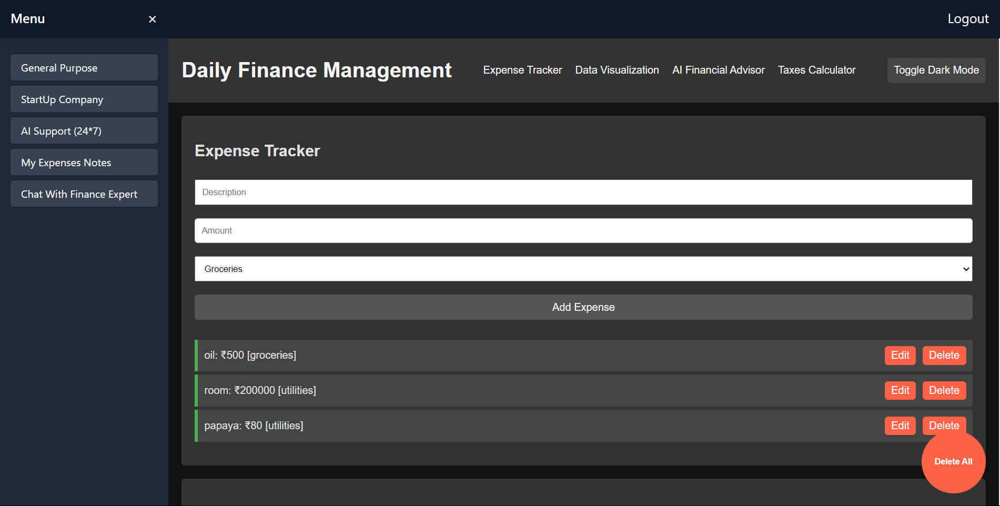

# Expense Tracker Website 📊💼

Expense Tracker Website is a comprehensive financial management platform designed to help users track expenses, visualize financial data, access AI-driven financial advice, manage personal notes, and consult with finance experts, all within a user-friendly interface.



## Features

### General Purpose Expense Tracker

- 📝 **Expense Tracker**: Manage and categorize expenses efficiently.
- 📊 **Data Visualization**: Visualize expense data through interactive charts.
- 🤖 **AI Financial Advisor**: Receive personalized financial advice.
- 💰 **Taxes Calculator**: Calculate taxes based on predefined rates.
- 🌗 **Dark Mode**: Toggle between light and dark themes.

### Startup Company Expense Tracker

- 🚀 **Expense Tracker**: Track startup-specific expenses.
- 📈 **Data Visualization**: Analyze startup finances with specialized tools.
- 🤖 **AI Financial Advisor**: Get tailored financial guidance for startups.
- 💰 **Taxes Calculator**: Calculate taxes optimized for startups.
- 🌗 **Dark Mode**: Switch themes for optimal viewing.

### AI Support 24*7

- 🤖 **Gemini AI**: Access AI support for various tasks.
- 🗨️ **ChatGPT**: Engage in interactive conversations.
- 🔀 **Toggle AI**: Switch between Gemini AI and ChatGPT.

### My Expense Notes

- 📒 **Sticky Notes**: Create personalized notes with customizable styles.

### Chat with Finance Expert

- 💬 **Consultation**: Pay $20 for a consultation with a finance expert.

### Logout

- 🔒 **Secure Access**: Log out to ensure privacy.

## Technologies Used

-   HTML5 - Standard markup language for creating web pages and web applications.
-   CSS3 - Stylesheet language used for describing the presentation of a document written in HTML.
-   JavaScript - High-level programming language used for creating interactive and dynamic websites.
-   Tailwind CSS - Utility-first CSS framework for quickly building custom designs.
-   Chart.js - JavaScript library for creating charts and graphs.
-   Google Generative AI - AI technology for generating creative content and providing AI-driven services.
-   Anime.js - Lightweight JavaScript animation library with a simple and powerful API.

## Usage

1. **Login**: Access the dashboard with your credentials.
2. **Navigate**: Select features from the sidebar to display on the right.
3. **Interact**: Utilize each feature's functionalities.
4. **Logout**: Securely end your session.

## Installation

1. Clone the repository:
   ```bash
   git clone https://github.com/kishlaychandan/kishlay-expense.git

## Contributing
Contributions are welcome! Please fork this repository and submit a pull request with your changes. For major changes, please open an issue first to discuss what you would like to change.

## Contact
- For any inquiries, please contact me at kishlaychandan01@gmail.com.

## Links
- 🔗 GitHub Repository: https://github.com/kishlaychandan/kishlay-expense
- 🌐 Hosted Application: https://warm-zabaione-9f18e0.netlify.app/
